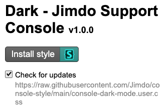

# Install Guide

## Install Stylus

[Chrome Extension](https://chrome.google.com/webstore/detail/stylus/clngdbkpkpeebahjckkjfobafhncgmne?hl=en)

[Firefox AddOn](https://addons.mozilla.org/en-US/firefox/addon/styl-us/)

## Add theme
Go to
https://github.com/Jimdo/console-style/raw/main/console-dark-mode.user.css

Press `Install style`
Make sure that `Check for updates` is set

